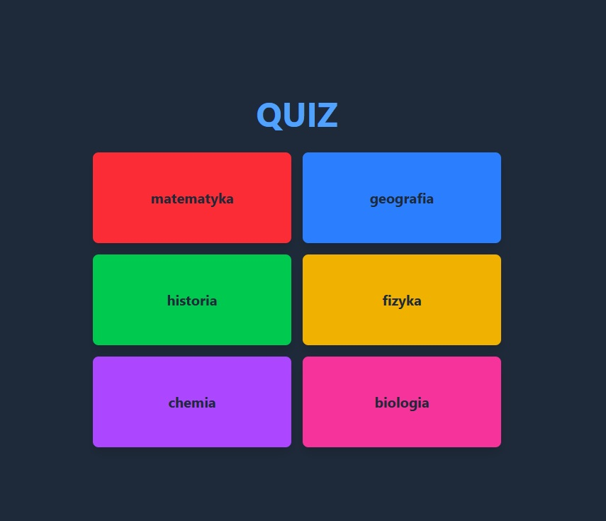

# ✨ Quiz App – React + TypeScript

A simple quiz that allows users to choose a category, answer questions, and receive a final score at the end.
Each question includes a timer, and when the time runs out, the user is automatically redirected to the final results page.

---

## ✨ Features

- Quiz category selection
- Question sorting and filtering
- Countdown timer for each question
- Automatic navigation to the next question
- Score summary saved in `localStorage`
- Error handling and loading states
- UI styling with TailwindCSS

---

## ✨ Technologies & Tools

- **React** – building UI components  
- **TypeScript** – static typing and code safety  
- **Vite** – fast development environment  
- **TailwindCSS** – application styling  
- **Zod** – data validation and TypeScript type generation  
- **MockAPI** – backend for questions and categorie  
- **React Router** – navigation between quiz questions  
- **Vercel** – hosting and CI/CD  

---

## 🌐 Live Demo

Click the image to see the live application:  

[](https://quiz-app-kubrycz.vercel.app/)

---

## ✨ Struktura projektu

```
src/
├─ components/
│  ├─ CategoryButton.tsx
│  ├─ Question.tsx
│  ├─ Timer.tsx
├─ data/
│  ├─ category.ts
│  ├─ questions.ts
├─ models/
│  ├─ category.ts
│  ├─ questions.ts
├─ pages/
│  ├─ Home.tsx
│  ├─ QuestionPage.tsx
│  ├─ Quiz.tsx
│  ├─ Results.tsx
├─ App.tsx
├─ doc.ts
├─ main.ts
```

---

# ✨ Quiz App – React + TypeScript

Prosty quiz, który pozwala użytkownikom wybierać kategorię, odpowiadać na pytania, a na końcu otrzymać wynik.  
Każde pytanie ma licznik, który po upływie czasu przekierowuje nas do wyniku końcowego.

---

## ✨ Funkcje

- Wybór kategorii quizu
- Sortowanie i filtrowanie pytań
- Timer odliczający czas na odpowiedź
- Automatyczne przejście do kolejnego pytania
- Podsumowanie wyniku w `localStorage`
- Obsługa błędów i stanu ładowania
- Stylizacja UI z TailwindCSS

---

## ✨ Technologie i narzędzia

- **React** – tworzenie komponentów UI  
- **TypeScript** – typowanie i bezpieczeństwo kodu  
- **Vite** – szybkie środowisko developerskie  
- **TailwindCSS** – stylizowanie aplikacji  
- **Zod** – walidacja danych i generowanie typów TS  
- **MockAPI** – backend do pytań i kategorii  
- **React Router** – nawigacja między pytaniami  
- **Vercel** – hosting i CI/CD  

---

## 🌐 Live Demo

Kliknij w obrazek, aby zobaczyć aplikację na żywo:  

[](https://quiz-app-kubrycz.vercel.app/)

---

## ✨ Struktura projektu

```
src/
├─ components/
│  ├─ CategoryButton.tsx
│  ├─ Question.tsx
│  ├─ Timer.tsx
├─ data/
│  ├─ category.ts
│  ├─ questions.ts
├─ models/
│  ├─ category.ts
│  ├─ questions.ts
├─ pages/
│  ├─ Home.tsx
│  ├─ QuestionPage.tsx
│  ├─ Quiz.tsx
│  ├─ Results.tsx
├─ App.tsx
├─ doc.ts
├─ main.ts
```
